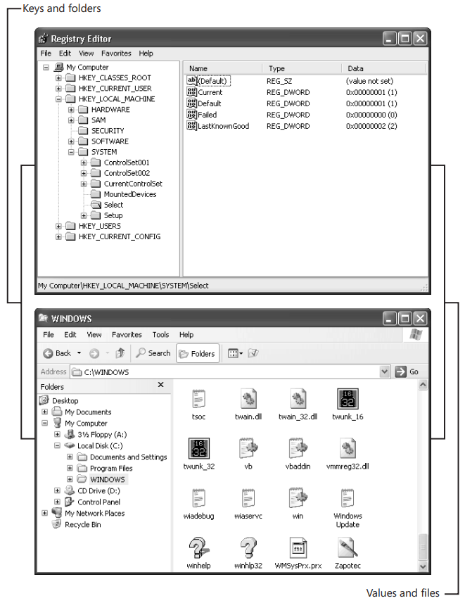
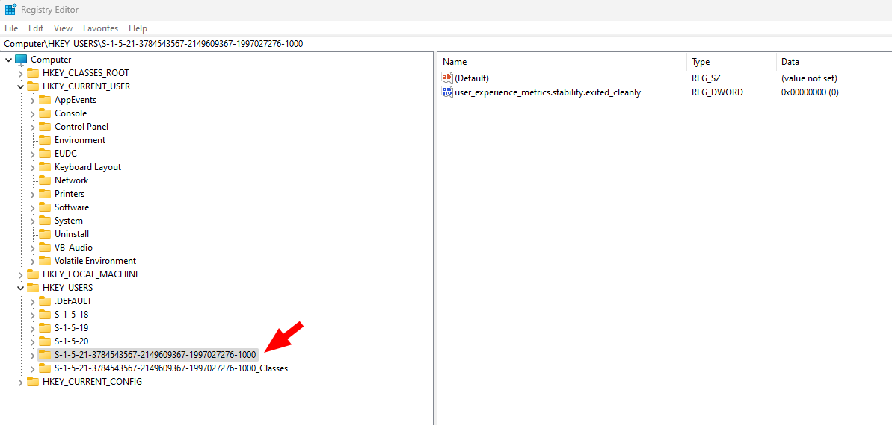

# Registo do Windows

O Registro do Windows é um banco de dados hierárquico que serve como um repositório central para dados de configuração (segundo a terminologia da Microsoft) ou como um banco de dados de configuração, que o sistema operacional carrega na memória do PC assim que o computador é iniciado ou o usuário faz login. Sem esse armazenamento prontamente disponível de configurações, arquivos e opções, nada pode ser iniciado ou operado no PC.

Conhecer o Registro do Windows traz vantagens concretas para os usuários. Diferentemente dos tempos antigos, quando as configurações eram armazenadas em arquivos de inicialização (como arquivos INI), hoje em dia, você sempre sabe onde começar a procurar quando precisa encontrar um valor específico. O Windows possui milhares de configurações que nunca aparecem em nenhuma caixa de diálogo, mas que podemos querer personalizar.

O Windows armazena várias arquivos do Registro, uma para as configurações que são relevantes para todos os usuários no PC, como hardware e opções gerais do sistema operacional, e outras específicas para cada usuário individual.

Os principais arquivos de registro estão localizados na pasta %systemroot%\System32\Config\ e consistem nos seguintes:

- SAM (Security Accounts Manager)
- SECURITY
- SOFTWARE
- SYSTEM
- DEFAULT
- USERDIFF (usado apenas para upgrades do sistema operacional)


*Imagem 1 - Arquivos de registro do Systema*

Além disso, cada usuário terá seus próprios arquivos de Registro:

- %userprofile%\ntuser.dat
- %userprofile%\AppData\Local\Microsoft\Windows\UsrClass.dat

O primeiro desses arquivos, ntuser.dat, contém as opções gerais de software, personalização e configuração do usuário. O segundo, UsrClass.dat, contém configurações adicionais, como associações de arquivos específicas do usuário e informações COM (Component Object Model).

Outro fato interessante é a estrutura do registro do Windows que é muito semelhante à estrutura do sistema de arquivos do Windows. A imagem 2 compara o Editor do Registro, a ferramenta que você usa para editar o registro, e o Windows Explorer. No painel esquerdo do editor, chamado key pane (painel de chaves), você vê a hierarquia do registro, assim como no Windows Explorer você vê a hierarquia do sistema de arquivos no painel esquerdo. Cada pasta no key pane é uma chave do registro. No painel direito do editor, chamado value pane (painel de valores), você vê os valores de uma chave, assim como no painel direito do Windows Explorer você vê o conteúdo de uma pasta.



*Imagem 2 - Removida do livro "Microsoft Windows Registry Guide", Jerry Honeycutt, 2005*

Embora estaja o nome completo de cada chave raiz no Editor do Registro, também podemos encontrar as abreviações em muitos lugares, segue abaixo a tabela.

| Nome                | Abreviação |
| ------------------- | ---------- |
| HKEY_CLASSES_ROOT   | HKCR       |
| HKEY_CURRENT_USER   | HKCU       |
| HKEY_LOCAL_MACHINE  | HKLM       |
| HKEY_USERS          | HKU        |
| HKEY_CURRENT_CONFIG | HKCC       |

No geral, embora o Registro do Windows seja um enorme com milhares de valores e códigos, ele é relativamente simples e direto de se trabalhar quando entendemos melhor sua estrutura.


## Práticando

Pesquisando o SID do usuário logado (current user)




### Manipulando os registro com Python

Foi seguindo o guia [Manipulating Windows Registry using winreg in Python](https://www.geeksforgeeks.org/manipulating-windows-registry-using-winreg-in-python/)

-  #### Adicionando a chave 'DoZeroAoUm' e o valor 'value One' com a informação "Do Zero Ao Um é o Melhor"


```python
import winreg as wrg 

location = wrg.HKEY_CURRENT_USER 

soft = wrg.OpenKeyEx(location, r"SOFTWARE\\") 
key  = wrg.CreateKey(soft, "DoZeroAoUm") 

wrg.SetValueEx(key, "value One", 0, wrg.REG_SZ, "Do Zero Ao Um é o Melhor") 
  
if key: 
    wrg.CloseKey(key)
```


- #### Lendo a informação do registro

```python
import winreg as wrg 

location = wrg.HKEY_CURRENT_USER 

soft = wrg.OpenKeyEx(location,r"SOFTWARE\\DoZeroAoUm\\") 
  
value = wrg.QueryValueEx(soft,"Value One") 
  
if soft: 
    wrg.CloseKey(soft) 
  
print(value)
```


- #### Deletando o valor 'Value One' da chave 'DoZeroAoUm'

```python
import winreg as wrg 

location = wrg.HKEY_CURRENT_USER 
  
soft = wrg.OpenKeyEx(location, r"SOFTWARE\\") 
key  = wrg.CreateKey(soft, "DoZeroAoUm") 

del_val = wrg.DeleteValue(key, "Value One") 
    
if key: 
    wrg.CloseKey(key) 
```


## Referências

- Mike Halsey e Andrew Bettany. *Windows Registry Troubleshooting*. Apress, 2013. Capítulo 1: "The Architecture of the Windows Registry".
  
- Jerry Honeycutt. *Microsoft Windows Registry Guide*. 2ª edição, Microsoft Press, 2005. Capítulos 1: "Learning the Basics", 2: "Using Registry Editor" e 3: "Backing Up the Registry".

- GeeksforGeeks. "Manipulating Windows Registry using winreg in Python." Acessado em 30 de agosto de 2024. https://www.geeksforgeeks.org/manipulating-windows-registry-using-winreg-in-python/.